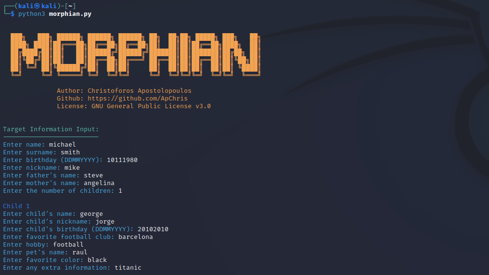
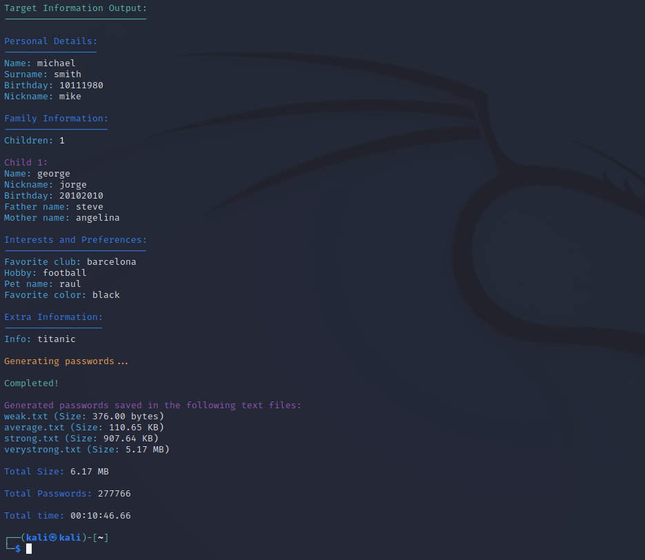

# Morphian

Morphian is a python3 tool designed to generate unique passwords by combining specific characteristics of the target. It can be used as an ethical hacking tool to assess passwords or for educational purposes.

## Purpose and Design

The tool has not been designed to generate all potential combinations of these characteristics combined with special characters. Instead, it focuses on providing the user with four wordlists containing possible passwords categorized into different strength levels based on their predictability.
The intention behind this design is to allow the user to start with more guessable passwords and then gradually progress to more secure and less predictable options.

## Installation

1. Clone the repository or download the `morphian.py` script.
2. Ensure you have Python 3.x installed on your system.
3. Install the required library by running the following command:
```
pip3 install zxcvbn
```

## Execution
1. Run the script using the following command:
```
python3 morphian.py
```
2. Follow the prompts to enter various characteristics such as name, surname, birthday, hobby, etc.

> Note: If you don't want to fill out a specific field just press enter.
   


3. The tool will then generate a list of possible passwords based on the given characteristics.
4. The generated passwords will be categorized into different strength levels based on their guessability.



## Results
Morphian will generate a list of unique possible user passwords by combining the provided characteristics. The generated passwords will be categorized into four different strength levels:

- Strength 0: Too guessable - risky password (guesses < 10^3).
- Strength 1: Very guessable - protection from throttled online attacks (guesses < 10^6).
- Strength 2: Somewhat guessable - protection from unthrottled online attacks (guesses < 10^8).
- Strength 3: Safely unguessable - moderate protection from offline slow-hash scenario (guesses < 10^10).
- Strength 4: Very unguessable - strong protection from offline slow-hash scenario (guesses >= 10^10).

The strength levels and corresponding protection descriptions are based on the zxcvbn library. Please refer to their repository and the `readme.md` for more detailed information. \
Reference: https://github.com/dropbox/zxcvbn#readme

The generated passwords will be appended to the respective text files:

- `weak.txt`: Contains passwords categorized as too guessable (strength 0).
- `average.txt`: Contains passwords categorized as very guessable (strength 1).
- `strong.txt`: Contains passwords categorized as somewhat guessable (strength 2) or safely unguessable (strength 3).
- `verystrong.txt`: Contains passwords categorized as very unguessable (strength 4).

## Note
Please ensure you use this tool responsibly and only on systems you have proper authorization to assess. Be mindful of any legal and ethical implications when using this tool.

## License
Morphian is licensed under the GNU General Public License v3.0.
